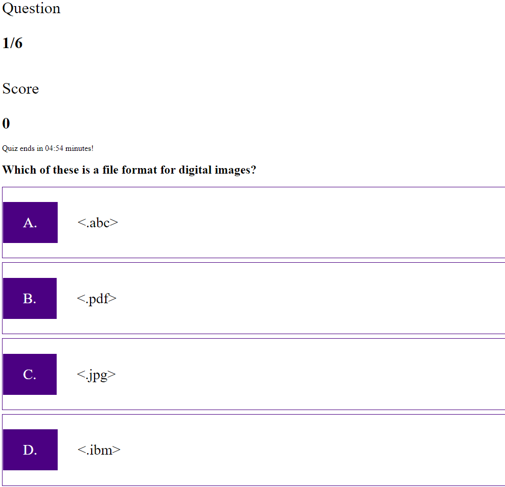

# Introduction:

Since a quiz is a way to test and improve your skills and understanding of a topic,
then buildling a Javascript quiz is a great way to learn the concepts of Javascript. 

# Project's Aim:

As a coding bootcamp student, I would like to take a timed quiz on Javascrip that stores high scores and gauges my progress with my peers. 

# Technologies used:

HTML, CSS, and JavaScript

# What I have learned:

1. Continuous learning and improving on the Javascript Fundamentals and application can open up a sea of possibilites on web development.
2. Pseudocoding provides a good visual aid and workflow on how to handle a project in manageable portions.
3. Order of workflow for me was: PseudoCoding -> create base HTML-> Create Javascript -> design the .css
4. Writing Comments helped in keeping organized!

#ScreenShot:

# Launch Deployed Link:
25 January 2022

Link to deployed project: https://shanchaiz.github.io/Code-Quiz-Mock/